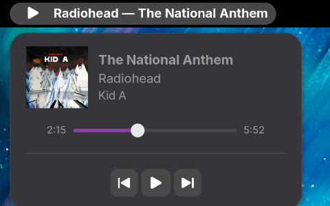

# NowBar

NowBar is a compact MPRIS media controller for the GNOME top panel.

It shows the currently playing track directly in the panel and provides a small popup with playback controls, album artwork, track information, and seek support.



## Features

- Shows artist and track title in the GNOME top panel
- Automatically detects MPRIS-compatible media players
- Album artwork
- Track title, artist and album
- Play / Pause
- Previous / Next track
- Interactive seek bar
- Current position and track duration
- Automatically hides when no supported player is available
- Supports multiple MPRIS players and prefers the currently playing one
- Compact GNOME-style popup

## Supported players

NowBar works with applications that expose an MPRIS interface.

Examples include:

- Spotify
- Firefox
- Chromium-based browsers
- VLC
- Rhythmbox
- mpv with MPRIS support
- Other MPRIS-compatible players

## Requirements

- GNOME Shell 51

## Installation

Download the latest `.shell-extension.zip` file from the GitHub Releases page and install it with:

```bash
gnome-extensions install --force nowbar@lovecatsnyou.github.io.shell-extension.zip
```

Then log out and log back in, and enable NowBar:

```bash
gnome-extensions enable nowbar@lovecatsnyou.github.io
```

You can also enable NowBar using the GNOME Extensions application.

## Development

To build a package from the repository:

```bash
gnome-extensions pack --force \
  --extra-source=indicator.js \
  --extra-source=mpris.js \
  --extra-source=LICENSE
```

`stylesheet.css` is included automatically by `gnome-extensions pack`.

For GNOME 49 and later, a nested development session can be started with:

```bash
dbus-run-session gnome-shell --devkit --wayland
```

## UUID

```text
nowbar@lovecatsnyou.github.io
```

## How it works

NowBar uses the standard MPRIS D-Bus interface:

```text
org.mpris.MediaPlayer2.*
```

It reads media metadata and playback state directly from compatible players, without requiring player-specific integrations.

## License

NowBar is licensed under the GNU General Public License v3.0 or later (GPL-3.0-or-later).

See [LICENSE](LICENSE) for details.
